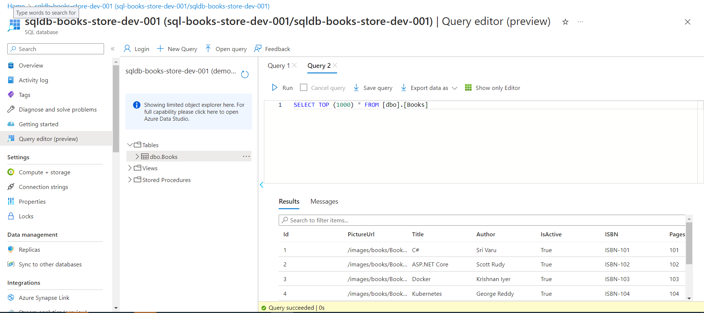
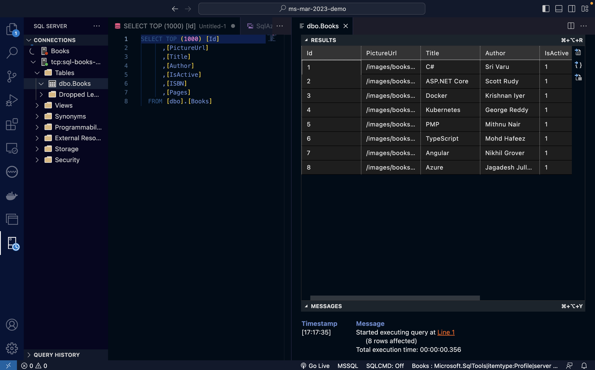

# Pradyun Reddy - Merge Sort - JDBC with Sqlite Console Apps.

## Date  Time:  5:54 pm Saturday, 18 March 2023(IST)

## Java Training acquired
 
 > 1. JAVA SWING: Subtle understanding of Swing components and functionalities and their role in creating customized and complex applications. Worked on basic applications such as Calculator, Basic sEmployee Management System etc., the inclusion of JDBC and OOPS concepts that makes it more custom-oriented and user interactive.
 
> 2. JAVA FX: Basic overview and brief understanding of JAVA FX and its use cases that can be implemented for creating applications. Worked on simple applications such as Calculator,Login Forms and To-do App where we can track attendance and add new employees and explored various components involved that make the portrayal of the application rich and interactive.
 
> 3. JAVA: Good understanding of OOPS concepts and JDBC.Currently, at a beginner’s level, but constantly working to build and sharpen my skills that can contribute to overall growth.
 
## Java Core Algorithms
 
> 1. Searching Algorithms
> 1. Sorting Algorithms

## Pull Request process, Continues Integration and Continues Delivery

## CRUD Operations with JDBC and Azure SQL Server

> 1. We have created SQL Server and Database in Azure portal.
> 1. We have created a single table called `Books` and prepopulated with few rows 
> 1. We have installed SQL Server extension in VSCode.
> 1. We will be able to connect to SQl Server and its database which has hosted in `Azure`.

### SQl Server and Database in Azure portal

### Connecting to SQL Server and Database hosted in Azure using VSCode

 
## JDBC with Sqlite Console App
 
> 1. Topic-1
> 1. Topic-2