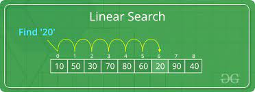
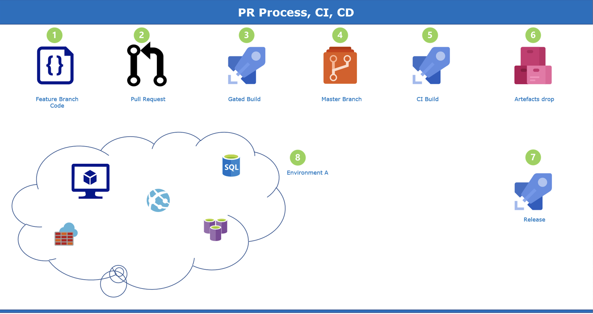
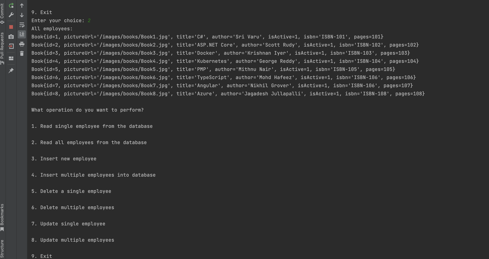

# Pradyun Reddy - Merge Sort - JDBC with Sqlite Console Apps.

## Date  Time:  5:54 pm Saturday, 18 March 2023(IST)

## Java Training acquired
 
 > 1. JAVA SWING: Subtle understanding of Swing components and functionalities and their role in creating customized and complex applications. Worked on basic applications such as Calculator, Basic sEmployee Management System etc., the inclusion of JDBC and OOPS concepts that makes it more custom-oriented and user interactive.
 
> 2. JAVA FX: Basic overview and brief understanding of JAVA FX and its use cases that can be implemented for creating applications. Worked on simple applications such as Calculator,Login Forms and To-do App where we can track attendance and add new employees and explored various components involved that make the portrayal of the application rich and interactive.
 
> 3. JAVA: Good understanding of OOPS concepts and JDBC.Currently, at a beginner’s level, but constantly working to build and sharpen my skills that can contribute to overall growth.
 
## Java Core Algorithms
 
> 1. Searching Algorithms : Performing two major searching algorithms-

> **Linear Search**: Linear search is a very simple search algorithm. In this type of search, a sequential search is done for all items one by one. Every item is checked and if a match is found then that particular item is returned, otherwise the search continues till the end of the data collection.                           
> Time Complexity: O(n).

 

> **Binary Search**: an efficient method of searching an ordered list. A binary search works like this: Start by setting the counter to the middle position in the list. If the value held there is a match, the search ends. If the value at the midpoint is less than the value to be found, the list is divided in half.

>Time Complexity: O(logn).

> Sorting Algorithm(Merge Sort): Merge sort is a sorting algorithm that works by dividing an array into smaller subarrays, sorting each subarray, and then merging the sorted subarrays back together to form the final sorted array.

                          
                            
                             
                            

## Pull Request process, Continues Integration and Continues Delivery 

**References:**
> 1. [https://learn.microsoft.com/en-us/azure/devops/repos/git/about-pull-requests?view=azure-devops](https://learn.microsoft.com/en-us/azure/devops/repos/git/about-pull-requests?view=azure-devops)
> 1. [https://learn.microsoft.com/en-us/azure/architecture/example-scenario/apps/devops-dotnet-baseline](https://learn.microsoft.com/en-us/azure/architecture/example-scenario/apps/devops-dotnet-baseline)

## CRUD Operations with JDBC and Azure SQL Server

> 1. We have created SQL Server and Database in Azure portal.
> 1. We have created a single table called `Books` and prepopulated with few rows 
> 1. We have installed SQL Server extension in VSCode.
> 1. We will be able to connect to SQl Server and its database which has hosted in `Azure`.

### SQl Server and Database in Azure portal

### Connecting to SQL Server and Database hosted in Azure using VSCode

 
## Read and Delete Operations

## TicTacToe Using JavaFX 

> Designing a basic tic-tac-toe program using  various Javafx components such as
grid pane , border pane, ellips,event handlers,cells and labels.

## Installation

To use this calculator app, you can follow the steps below:

> 1. Clone the repository. You can also download the zip file and extract it to your preferred directory.

> 2. Open the project in your favorite Java IDE (e.g. Eclipse, IntelliJ IDEA, NetBeans). Ensure that you have installed the necessary dependencies required for the project to run.

> 3. Run the Main.java file. This should open the Tic-tac-toe window. 

## Usage

### The application is designed to perform a basic tic-tac toe game.
> 1. The game first begins with X's Turn .

> 2. Followed by X's Turn is that of O's.

> 3. The process loops until there is a tie case or until a winner is obtain by obtaining the right patterns.

> 4. The Result is displayed in the text field below.

## Design 

.png)

## Code Description

> 1. Create Main class which extend Application and override start method.(https://github.com/pradyunpr7/bpr-mar-demo-2023/blob/main/JavaFX/tictactoe/Main.java)

